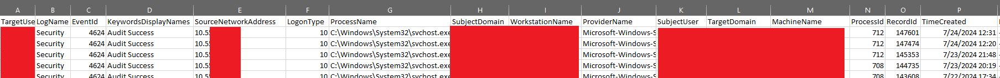

<h1 align="center">
AuthMap
</h1>

### What is it?
A PowerShell script that helps blue-teamers aggregate Windows authentication activity from across an Active Directory network.

### How does it work?

AuthMap dynamically builds a PowerShell script that is launched on remote computers using Windows Management Instrumentation (WMI).  The script builds a CSV locally on all target devices - after launching all remote jobs, AuthMap continuously loops through reachable devices to check if the output exists via SMB, copying it back to the local computer and removing it from the remote destination.

After all outputs are collected, AuthMap merges individual device results into a single aggregated CSV of data for easy analysis.

### How do I use it?
Download authmap.ps1 and launch using one or more of the following parameters:
```
-targetusername - Specify the name to use for Event Log Filtering. Default is any user.
-daysback - How many days backwards to filter Event Logs from the current system time on each host Default is 7.
-logontypes - Specify logon types to filter on in a comma-delimited string like '3,5,10' Default is any type.


.\authmap.ps1 -targetusername 'admin' -daysback 30 -> Pull 30 days worth of login activity for user 'admin' across all Logon Types
.\authmap.ps1 -daysback 7 -logontypes 10 -> Pull 7 days worth of type 10 activity across the environment
```

### Expected Outcomes
AuthMap will pull back an individual CSV from each target device and ultimately merge these together into a single output file.  

Since AuthMap relies on 4624 events, the columns of the CSV consist of the critical data extracted from these events - an example of the final output is shown below:

<p align="center">

</p>